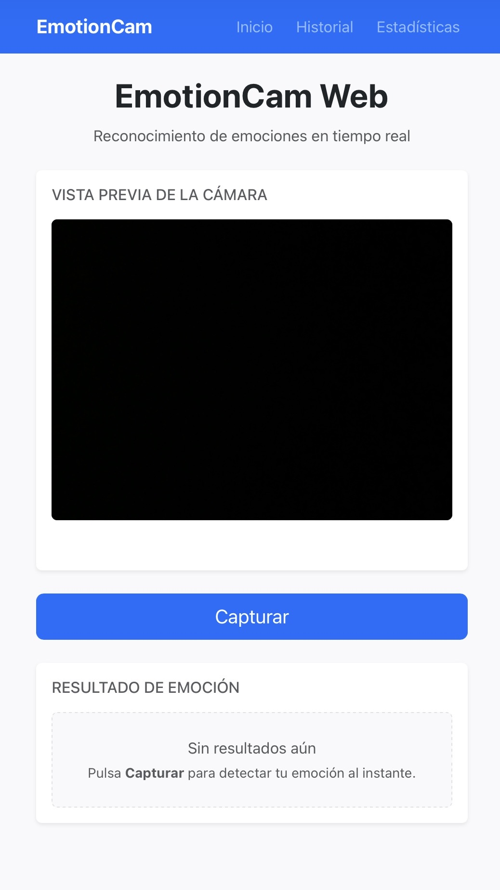
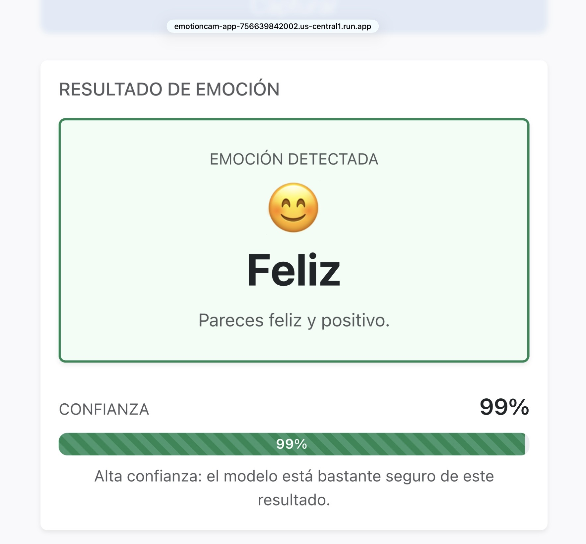
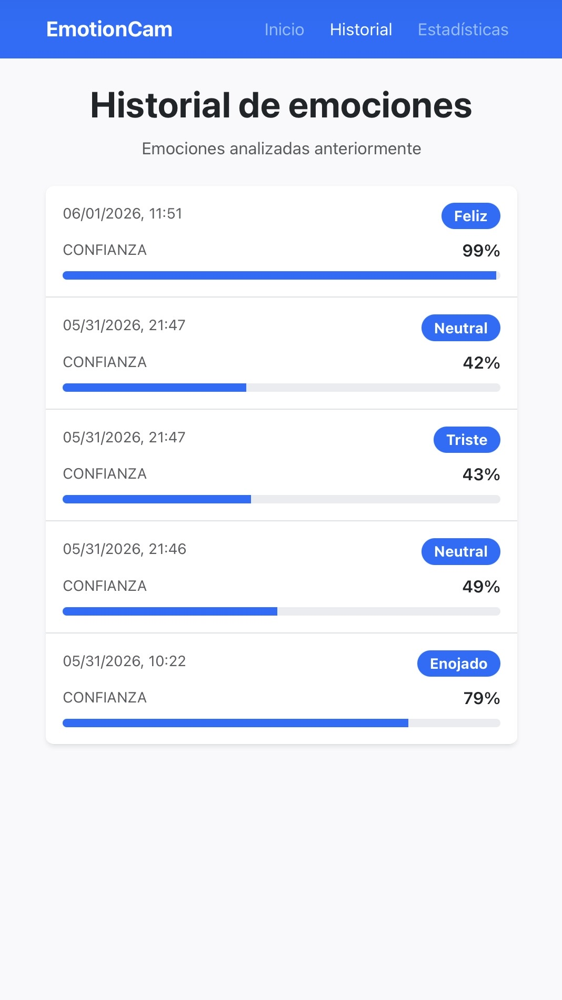
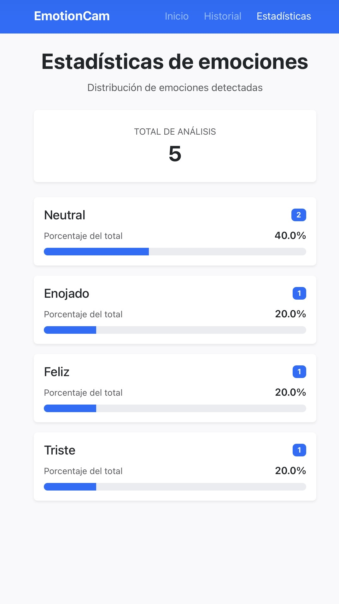

# EmotionCam Web

**Reconocimiento facial de emociones en tiempo real impulsado por DeepFace y Flask**

EmotionCam Web es una aplicación web orientada a dispositivos móviles que detecta emociones humanas a partir de la cámara en vivo. Los usuarios capturan una foto con un solo toque, y el sistema analiza automáticamente las expresiones faciales mediante aprendizaje profundo, muestra el resultado con una puntuación de confianza y almacena cada análisis para revisiones posteriores.

---

## Descripción General

Comprender las emociones humanas a partir de expresiones faciales es un problema fundamental en la inteligencia artificial, con aplicaciones en la interacción humano-computadora, accesibilidad, educación e investigación de experiencia de usuario. La interpretación manual de emociones es subjetiva y no escala; los sistemas automatizados pueden ofrecer información consistente y basada en datos en tiempo real.

EmotionCam Web aborda este desafío proporcionando una herramienta práctica de reconocimiento de emociones basada en el navegador. La aplicación combina visión por computadora, aprendizaje profundo y una pila web ligera para que los usuarios interactúen con un modelo de IA a través de la cámara de su dispositivo, sin necesidad de instalar software nativo. La interfaz está diseñada para dispositivos móviles y está completamente localizada en español, lo que la hace adecuada para demostraciones, evaluaciones académicas y presentaciones de portafolio.

---

## Características

- **Vista previa de cámara en vivo** con soporte para cámara frontal
- **Captura y análisis con un solo toque** — captura, carga y análisis en una sola acción
- **Reconocimiento de emociones con DeepFace** con detección de la emoción dominante
- **Visualización de puntuación de confianza** con barra de progreso e indicaciones contextuales
- **Interfaz en español** (UI, errores y etiquetas de resultados)
- **Página de historial de emociones** — registro cronológico de análisis anteriores
- **Página de estadísticas** — distribución de emociones con conteos y porcentajes
- **Persistencia en Google Cloud Firestore** para los registros de análisis
- **Historial y estadísticas por dispositivo** mediante identificadores de dispositivo basados en el navegador
- **Diseño responsivo mobile-first** optimizado para Safari en iPhone
- **Manejo seguro de cargas de archivos** con validación y límites de tamaño
- **Manejo de errores robusto** para caras no detectadas, problemas de cámara y fallos de red

---

## Componente de Inteligencia Artificial

### DeepFace

[DeepFace](https://github.com/serengil/deepface) es un framework de Python de código abierto para análisis facial. Envuelve modelos de aprendizaje profundo preentrenados (construidos sobre TensorFlow/Keras) que realizan detección de rostros e inferencia de atributos. En este proyecto, DeepFace se utiliza exclusivamente para el **reconocimiento de emociones**.

### Reconocimiento de Emociones

Cuando se envía una imagen para análisis, DeepFace detecta rostros en la fotografía y evalúa cada rostro contra siete categorías de emociones:

| Emoción (EN) | Etiqueta (ES) |
|--------------|---------------|
| Angry        | Enojado       |
| Disgust      | Asco          |
| Fear         | Miedo         |
| Happy        | Feliz         |
| Sad          | Triste        |
| Surprise     | Sorprendido   |
| Neutral      | Neutral       |

El modelo devuelve una distribución de probabilidad entre las siete clases para cada rostro detectado.

### Detección de Emoción Dominante

La **emoción dominante** es la clase con la mayor probabilidad predicha en la salida de DeepFace. La aplicación extrae este valor mediante `dominant_emotion` y lo normaliza a una etiqueta en minúsculas antes de devolverlo al cliente y almacenarlo en la base de datos.

Si no se detecta ningún rostro en la imagen (`enforce_detection=True`), el servicio lanza un error dedicado y el usuario recibe un mensaje claro para ajustar la iluminación o el ángulo de la cámara.

### Generación de Puntuación de Confianza

La puntuación de confianza corresponde a la probabilidad predicha por el modelo para la clase de emoción dominante, expresada como un porcentaje entero (0–100). El valor se lee directamente del diccionario de puntuaciones de emociones de DeepFace y se limita a un máximo de 100 para evitar anomalías de visualización por redondeo de punto flotante.

---

## Arquitectura del Sistema

```
┌─────────────────────────────────────────────────────────────┐
│                     Navegador (Cliente)                      │
│  ┌──────────────┐  ┌──────────────┐  ┌──────────────────┐  │
│  │ Bootstrap UI │  │  camera.js   │  │ MediaDevices API │  │
│  └──────┬───────┘  └──────┬───────┘  └────────┬─────────┘  │
└─────────┼─────────────────┼───────────────────┼──────────────┘
          │                 │                   │
          │    HTTP (HTML)   │   REST (JSON)     │  getUserMedia
          ▼                 ▼                   ▼
┌─────────────────────────────────────────────────────────────┐
│                  Backend Flask (app.py)                      │
│  ┌──────────┐  ┌──────────┐  ┌──────────┐  ┌────────────┐  │
│  │  Rutas   │  │  Carga   │  │ Analizar │  │ Plantillas │  │
│  └────┬─────┘  └────┬─────┘  └────┬─────┘  └────────────┘  │
│       │             │             │                         │
│       │             ▼             ▼                         │
│       │      ┌────────────┐  ┌─────────────────┐           │
│       │      │  uploads/  │  │ emotion_service │           │
│       │      └────────────┘  └────────┬────────┘           │
│       │                               │                     │
│       ▼                               ▼                     │
│  ┌─────────────┐              ┌──────────────┐             │
│  │  database/  │              │   DeepFace   │             │
│  │ (Firestore) │              │  (TensorFlow)│             │
│  └─────────────┘              └──────────────┘             │
└─────────────────────────────────────────────────────────────┘
```

### Backend Flask

El backend está construido con **Flask 3.x** y expone tanto páginas renderizadas en el servidor como endpoints de API JSON. Gestiona las cargas de imágenes, coordina el análisis de emociones, persiste los resultados y sirve las vistas de historial y estadísticas.

| Ruta       | Método | Descripción                                    |
|------------|--------|------------------------------------------------|
| `/`        | GET    | Página principal de cámara y análisis          |
| `/history` | GET    | Historial de análisis de emociones             |
| `/stats`   | GET    | Estadísticas de distribución de emociones      |
| `/upload`  | POST   | Recibir y almacenar imagen capturada           |
| `/analyze` | POST   | Ejecutar análisis DeepFace sobre imagen cargada|

### Frontend con Bootstrap

La interfaz de usuario utiliza **Bootstrap 5.3** (CDN) con CSS personalizado para un diseño limpio y mobile-first. La página principal (`index.html`) proporciona la vista previa de la cámara, el botón de captura y el panel de resultados. Las páginas de historial y estadísticas comparten una barra de navegación consistente y un ancho de contenedor máximo de 480 px.

La lógica del lado del cliente en `camera.js` gestiona el acceso a la cámara, la captura de fotogramas mediante HTML5 Canvas, las solicitudes asíncronas de carga/análisis y la representación dinámica de resultados.

### Base de Datos Firestore

Los resultados del análisis se almacenan en **Google Cloud Firestore** en una colección llamada `emotions`. Cada documento contiene los siguientes campos:

| Campo       | Tipo       | Descripción                            |
|-------------|------------|----------------------------------------|
| `device_id` | string     | UUID anónimo del dispositivo           |
| `timestamp` | timestamp  | Marca de tiempo UTC del análisis       |
| `emotion`   | string     | Etiqueta de emoción dominante (minúsc.)|
| `confidence`| number     | Puntuación de confianza (0–100)        |

### Integración de Cámara

La **API MediaDevices** del navegador (`getUserMedia`) accede a la cámara del dispositivo con:

- Modo de cámara frontal (`facingMode: "user"`)
- Atributos `playsinline` y `muted` para compatibilidad con iOS Safari
- Requisito de HTTPS aplicado mediante verificación de contexto seguro (satisfecho por ngrok o localhost)

Los fotogramas capturados se dibujan en un canvas oculto y se exportan como blobs JPEG para su carga.

### Servicio DeepFace

El módulo `services/emotion_service.py` encapsula toda la lógica de IA. Acepta una ruta de archivo, invoca `DeepFace.analyze()` con `actions=["emotion"]`, extrae la emoción dominante y la confianza, y devuelve un diccionario estructurado compatible con JSON. El manejo de errores distingue entre archivo no encontrado, rostro no detectado y fallos generales de análisis.

---

## Flujo de la Aplicación

```
Usuario
  │
  ▼
Abre la aplicación en el navegador móvil (HTTPS)
  │
  ▼
Cámara ──► La vista previa en vivo inicia vía getUserMedia
  │
  ▼
Captura ──► El usuario toca "Capturar"
  │           El fotograma se dibuja en un canvas oculto
  │
  ▼
Carga ──► JPEG enviado a POST /upload
  │          Guardado en uploads/ con nombre de archivo UUID
  │
  ▼
Análisis DeepFace ──► POST /analyze con nombre de archivo
  │                    Detección de rostro + inferencia de emoción
  │
  ▼
Visualización de Resultado ──► Etiqueta de emoción, ícono, resumen,
  │                            barra de confianza mostrada en español
  │
  ▼
Almacenamiento en Base de Datos ──► Registro insertado en Firestore
                                    (device_id, emotion, confidence, timestamp)
```

---

## Tecnologías Utilizadas

| Categoría            | Tecnología                        |
|----------------------|-----------------------------------|
| Framework backend    | Flask 3.x                         |
| IA / Aprendizaje prof.| DeepFace, TensorFlow 2.x         |
| Visión por computadora| OpenCV (headless)                |
| Base de datos        | Google Cloud Firestore            |
| Framework frontend   | Bootstrap 5.3                     |
| Scripts del cliente  | JavaScript Vanilla (ES5+)         |
| API de cámara        | MediaDevices / getUserMedia       |
| Procesamiento de imagen| HTML5 Canvas                    |
| Lenguaje             | Python 3.12                       |
| Túnel (móvil)        | ngrok                             |

---

## Estructura del Proyecto

```
Emotion Detector/
├── app.py                  # Aplicación Flask y definición de rutas
├── requirements.txt        # Dependencias de Python
├── README.md               # Documentación del proyecto
│
├── database/
│   ├── db.py               # Capa de compatibilidad de persistencia
│   └── firestore_db.py     # Módulo de persistencia en Firestore
│
├── services/
│   └── emotion_service.py  # Servicio de análisis de emociones con DeepFace
│
├── templates/
│   ├── index.html          # Página principal de cámara y análisis
│   ├── history.html        # Vista del historial de emociones
│   └── stats.html          # Vista de estadísticas de emociones
│
├── static/
│   ├── css/
│   │   └── style.css       # Estilos personalizados mobile-first
│   └── js/
│       └── camera.js       # Lógica de cámara, captura y cliente API
│
├── uploads/                # Imágenes capturadas almacenadas (en .gitignore)
└── instance/
    └── emotions.db         # Ruta heredada de SQLite (en .gitignore; no requerida para Firestore)
```

---

## Instalación

### Requisitos Previos

- Python 3.10 o superior
- pip
- Una cámara web o dispositivo móvil con acceso a cámara
- (Opcional) [ngrok](https://ngrok.com/) para pruebas móviles sobre HTTPS

### Pasos

1. **Clonar el repositorio**

   ```bash
   git clone https://github.com/<tu-usuario>/emotion-detector.git
   cd emotion-detector
   ```

2. **Crear y activar un entorno virtual**

   ```bash
   python -m venv .venv
   source .venv/bin/activate        # Linux / macOS
   .venv\Scripts\activate           # Windows
   ```

3. **Instalar dependencias**

   ```bash
   pip install -r requirements.txt
   ```

   > **Nota:** La primera ejecución descargará los pesos del modelo DeepFace (~100 MB). Asegúrate de tener una conexión a internet estable.

---

## Ejecutar el Proyecto

Inicia el servidor de desarrollo Flask:

```bash
python app.py
```

La aplicación estará disponible en:

```
http://localhost:5000
```

## Variables de Entorno

La aplicación requiere las siguientes variables de entorno cuando se usa Firestore:

- `GOOGLE_APPLICATION_CREDENTIALS` (recomendado para pruebas locales): ruta a un archivo JSON de clave de cuenta de servicio.
- `FIRESTORE_PROJECT_ID` o `GOOGLE_CLOUD_PROJECT`: el ID del proyecto GCP donde Firestore está habilitado.

En producción (Cloud Run), se prefiere Workload Identity / cuentas de servicio de Cloud Run en lugar de claves JSON.

## Despliegue en Cloud Run

Despliega la aplicación en Google Cloud Run usando Workload Identity para una autenticación segura sin claves:

### Paso 1: Crear una cuenta de servicio

```bash
gcloud iam service-accounts create emotioncam-sa \
  --display-name "EmotionCam Service Account"
```

Reemplaza `emotioncam-sa` con tu nombre preferido.

### Paso 2: Otorgar permisos de Firestore

```bash
gcloud projects add-iam-policy-binding PROJECT_ID \
  --member="serviceAccount:emotioncam-sa@PROJECT_ID.iam.gserviceaccount.com" \
  --role="roles/datastore.user"
```

Reemplaza `PROJECT_ID` con tu ID de proyecto de Google Cloud.

### Paso 3: Construir y subir la imagen Docker

```bash
gcloud builds submit --tag IMAGE_URL
```

Reemplaza `IMAGE_URL` con la ruta completa de la imagen, p. ej., `gcr.io/PROJECT_ID/emotioncam-app`.

### Paso 4: Desplegar en Cloud Run

```bash
gcloud run deploy emotioncam-app \
  --image IMAGE_URL \
  --service-account emotioncam-sa@PROJECT_ID.iam.gserviceaccount.com \
  --set-env-vars GOOGLE_CLOUD_PROJECT=PROJECT_ID \
  --region us-central1 \
  --memory 4Gi \
  --cpu 2 \
  --timeout 120 \
  --allow-unauthenticated
```

Reemplaza `IMAGE_URL` y `PROJECT_ID` con tus valores.

### Nota sobre el arranque en frío

La primera solicitud después de que una instancia de Cloud Run arranca en frío puede tardar entre 20 y 40 segundos mientras TensorFlow carga los modelos de DeepFace. Para evitar arranques en frío en escenarios de demostración, opcionalmente establece `--min-instances 1` a costa de facturación continua:

```bash
gcloud run deploy emotioncam-app \
  --image IMAGE_URL \
  --service-account emotioncam-sa@PROJECT_ID.iam.gserviceaccount.com \
  --set-env-vars GOOGLE_CLOUD_PROJECT=PROJECT_ID \
  --region us-central1 \
  --memory 4Gi \
  --cpu 2 \
  --timeout 120 \
  --allow-unauthenticated \
  --min-instances 1
```


## Configuración de Google Cloud Firestore

1. Habilita la API de **Cloud Firestore** en tu proyecto de Google Cloud.
2. Crea una cuenta de servicio con los siguientes roles de IAM:
   - `Cloud Datastore User` o `Cloud Firestore User`
   - `Cloud Firestore Viewer` (para acceso de solo lectura si es necesario)
   - `Cloud Logging > Logs Writer` (opcional, para registro de la app en GCP)
3. Genera y descarga un archivo de clave JSON para la cuenta de servicio.
4. Establece las variables de entorno:

   ```bash
   export GOOGLE_APPLICATION_CREDENTIALS="/ruta/a/tu-clave.json"
   export FIRESTORE_PROJECT_ID="tu-id-proyecto-gcp"
   ```

   Si usas Application Default Credentials o Workload Identity, puede que solo se requiera `FIRESTORE_PROJECT_ID`.

5. Confirma que las credenciales están disponibles antes de iniciar la app:

   ```bash
   python -c "from google.auth import default; creds, project = default(); print(project)"
   ```

6. Inicia la app:

   ```bash
   python app.py
   ```

Abre esta URL en un navegador de escritorio para pruebas locales. El acceso a la cámara requiere un contexto seguro (HTTPS o localhost).

---

## Seguridad y Privacidad

### Modelo de Aislamiento por Dispositivo

La aplicación utiliza un **modelo de aislamiento anónimo por dispositivo** para el historial y las estadísticas:

1. En la primera visita, el navegador genera un UUID único usando `crypto.randomUUID()` y lo almacena en `localStorage` bajo la clave `emotion_device_id`.
2. Este UUID se envía con cada solicitud de análisis de emociones y se almacena en Firestore como `device_id`.
3. Las páginas de historial y estadísticas se filtran en el servidor para mostrar solo los registros que coincidan con el UUID del dispositivo actual.

### Limitaciones

- **No firmado criptográficamente**: El UUID del dispositivo no está firmado, cifrado ni validado por el servidor. Cualquier cliente puede establecer o adivinar un valor diferente de `device_id` y ver el historial de otro dispositivo si conoce o adivina el UUID.
- **No apto para datos sensibles**: Este modelo es apropiado para demos, proyectos académicos y exhibiciones públicas, pero no para datos personalmente sensibles o regulados.
- **No se recopilan datos personales**: La aplicación recopila únicamente resultados de análisis de emociones, marcas de tiempo y UUIDs de dispositivos; no recopila direcciones IP, huellas digitales del navegador u otra información de identificación personal.

### Casos de Uso Recomendados

- Demostraciones educativas
- Proyectos académicos
- Quioscos y exhibiciones públicas
- Presentaciones de portafolio

### Si se requiere mayor privacidad

Para sistemas en producción que manejen datos sensibles, considera:
- Agregar tokens firmados emitidos por el servidor con tiempo de expiración.
- Implementar autenticación de usuario opcional y gestión de sesiones.
- Cifrar campos sensibles en Firestore.
- Agregar auditoría de registros y controles de acceso.

---

## Pruebas Móviles con ngrok

Los navegadores móviles requieren HTTPS para el acceso a la cámara. Usa ngrok para exponer el servidor local de forma segura:

1. **Inicia el servidor Flask**

   ```bash
   python app.py
   ```

2. **Inicia ngrok en una terminal separada**

   ```bash
   ngrok http 5000
   ```

3. **Abre la URL HTTPS** proporcionada por ngrok (p. ej., `https://abc123.ngrok-free.app`) en tu iPhone o dispositivo Android usando Safari o Chrome.

4. **Otorga permiso de cámara** cuando se te solicite.

5. **Precalienta el modelo** realizando una captura de prueba antes de una demostración en vivo. El primer análisis puede tardar entre 15 y 30 segundos mientras DeepFace carga sus modelos.

---

## Instrucciones de Uso

1. Abre la aplicación en un navegador móvil compatible (se requiere HTTPS).
2. Permite el acceso a la cámara cuando el navegador lo solicite.
3. Posiciona tu rostro dentro de la vista previa de la cámara en vivo.
4. Toca **Capturar** para capturar y analizar tu expresión.
5. Espera a que se complete el análisis (se muestra un indicador de carga).
6. Revisa la **emoción** detectada y la **puntuación de confianza**.
7. Navega a **Historial** para ver análisis anteriores.
8. Navega a **Estadísticas** para ver la distribución de emociones en todas las sesiones.

### Consejos para Mejores Resultados

- Mira directamente a la cámara con iluminación adecuada.
- Evita ángulos extremos u oclusión parcial del rostro.
- Espera a que la vista previa de la cámara cargue completamente antes de capturar.
- Si no se detecta ningún rostro, ajusta la posición y vuelve a intentarlo.

---

## Capturas de Pantalla

> Reemplaza los marcadores de posición a continuación con capturas de pantalla reales antes de publicar.

### Página Principal — Cámara y Análisis



### Resultado de Emoción



### Página de Historial



### Página de Estadísticas



---

## Mejoras Futuras

- **Análisis de video en tiempo real** — detección continua de emociones sin captura manual
- **Soporte para múltiples rostros** — analizar varios rostros en un solo fotograma
- **Autenticación de usuarios** — historial personal y gestión de sesiones
- **Selección de modelo** — permitir cambiar entre modelos backend de DeepFace
- **Pipeline de despliegue** — alojamiento en producción en Render, Railway o similar
- **Visualización de zona horaria local** — convertir marcas de tiempo UTC a la configuración regional del usuario
- **Política de limpieza de imágenes** — eliminación automática de cargas antiguas para gestionar el uso del disco
- **Indicador de progreso** — retroalimentación detallada durante la carga larga del modelo
- **Internacionalización** — soporte para idiomas adicionales más allá del español
- **Pruebas unitarias y de integración** — cobertura de pruebas automatizadas para la API y las capas de servicio

---

## Contexto Académico

Este proyecto fue desarrollado como parte de un **curso de Inteligencia Artificial** a nivel universitario. Demuestra la aplicación práctica de conceptos de aprendizaje profundo —específicamente visión por computadora y análisis de expresiones faciales— en una aplicación web full-stack.

El proyecto abarca temas clave de IA e ingeniería de software, incluyendo:

- Integración de modelos de aprendizaje profundo preentrenados a través de DeepFace
- Detección de rostros y clasificación de emociones multiclase
- Puntuación de confianza e interpretación de resultados
- Construcción de un sistema de IA orientado al usuario con manejo apropiado de errores
- Persistencia y visualización de resultados de inferencia de IA
- Diseño mobile-first para la interacción con IA en el mundo real

EmotionCam Web sirve tanto como prototipo funcional como pieza de portafolio que demuestra la capacidad de conectar herramientas de investigación en IA con un diseño de software accesible y orientado a producción.

---

## Licencia

Este proyecto fue creado con fines académicos. Consulta el repositorio para obtener detalles sobre la licencia.
